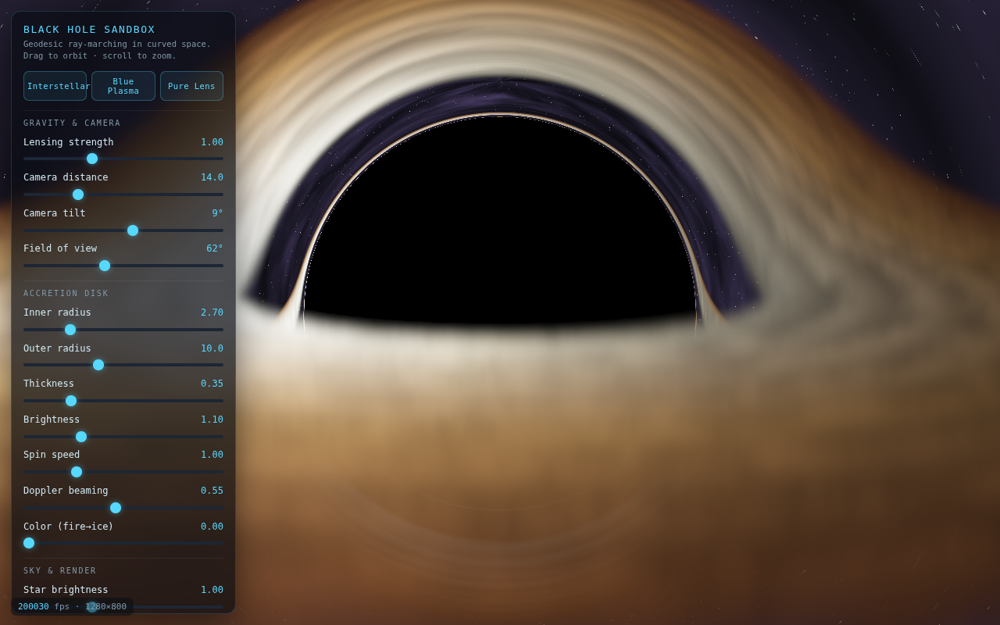
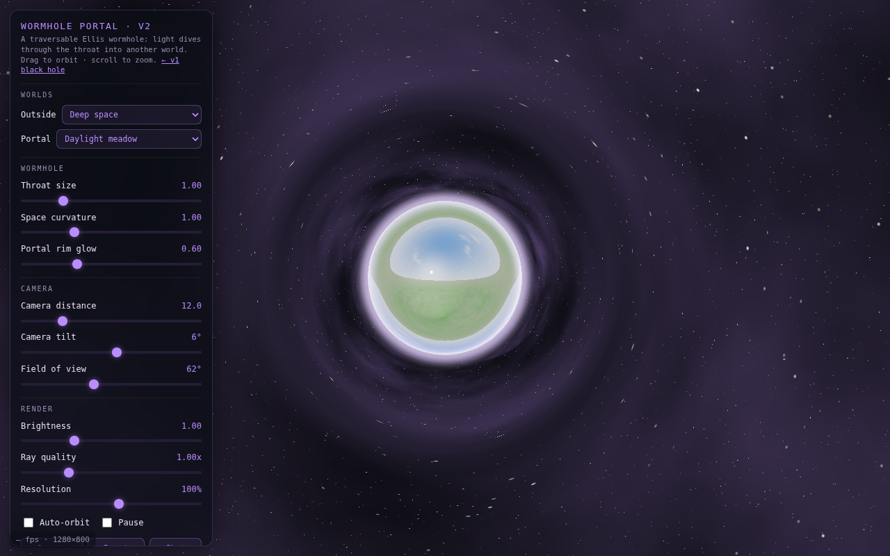
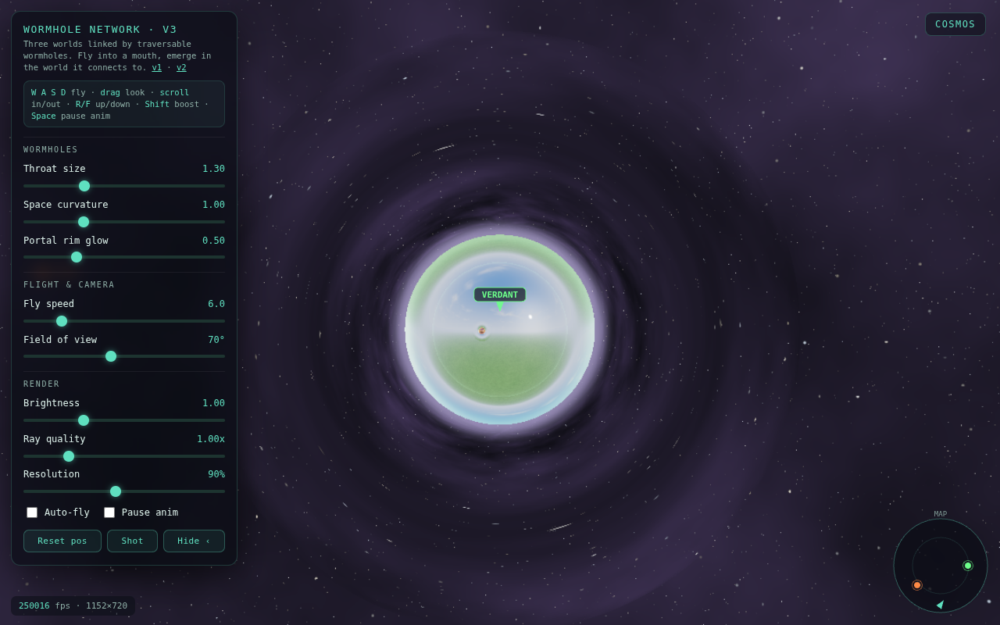

# Wormhole Sandbox

Real-time gravitational lensing in the browser. A single black hole, a traversable
wormhole, and a small network of worlds you can fly between through wormhole mouths.
Everything is ray-marched through curved space in a WebGL fragment shader, with no
dependencies and no asset files (worlds and skyboxes are procedural).

Inspired by olof_src's [realtime wormholes in browser](https://www.reddit.com/r/computergraphics/comments/1vslkcc/realtime_wormholes_in_browser/)
post on r/computergraphics. The core idea, from that thread: instead of tracing straight
lines through flat space, you trace geodesics through a curved metric, updating the ray's
direction each step according to the spacetime it is passing through.

## Versions

### v1 - Black hole (`index.html`)

A Schwarzschild black hole: dark shadow, bright photon ring, and an accretion disk that is
lensed so the far side wraps up over the top and under the bottom (the Interstellar look),
with a gravitationally lensed starfield behind. Sliders for lensing strength, disk geometry,
brightness, spin, Doppler beaming, colour, and camera.



### v2 - Wormhole portal (`v2.html`)

A traversable Ellis / Morris-Thorne wormhole. Light that dives into the throat emerges in
another world, fisheye-distorted by the curvature, ringed by an Einstein ring. Light aimed
wide is lensed but stays in this world. Pick the world outside and the world inside from two
dropdowns (deep space, daylight meadow, alien sunset, twin-moon night).



### v3 - Wormhole network (`v3.html`)

Three worlds (Cosmos, Verdant, Ember) linked by six wormhole mouths in a triangle: each world
has one mouth to each of the others. Free-flight camera; fly into a mouth and you emerge in
the world it connects to. A ray can pass through a portal, into a world, and through another
portal, so you can see worlds nested inside portals. Includes a top-down mini-map, on-screen
arrows pointing to each mouth, and scroll-to-dolly.



## Controls

- v1 / v2: drag to orbit, scroll to zoom. Space pauses animation, `H` hides the panel.
- v3: **W A S D** to fly, **drag** to look, **scroll** to move in/out, **R/F** up/down,
  **Shift** to boost, **Space** to pause animation, **H** to hide the panel.

## Running

Open any of the `.html` files directly in a browser (they are self-contained), or serve the
folder over http:

```sh
python3 -m http.server 8000
# then open http://localhost:8000/index.html
```

## How it works

Each pixel casts a ray from the camera and integrates its path through a curved metric.

- **v1 (Schwarzschild).** Photons follow the null geodesic `u'' + u = (3/2) rs u^2` (with
  `u = 1/r`). In Cartesian form the integrator applies an acceleration toward the singularity
  of `-1.5 * h2 * pos / r^5` (units `rs = 1`), where `h2` is the conserved squared angular
  momentum. Rays that fall below the event horizon are captured (black); rays that escape
  sample the starfield; the accretion disk is integrated volumetrically with a temperature
  ramp and relativistic Doppler beaming.
- **v2 / v3 (Ellis wormhole).** The metric is `ds^2 = -dt^2 + dl^2 + (b^2 + l^2) dOmega^2`,
  where `l` is the proper radial coordinate (positive on this side, negative on the other) and
  `b` is the throat radius. In the ray plane the geodesic reduces to `l'' = L^2 l / r^4` and
  `phi' = L / r^2` with `r = sqrt(b^2 + l^2)`, integrated with RK4. Rays with small angular
  momentum pass through the throat (`l` goes negative) and emerge in the other world; rays with
  large angular momentum are lensed but stay. The boundary between the two is the visible
  circular portal edge, and the grazing rays (`|L| ~ b`) form the Einstein ring.
- **v3 transport.** Worlds are flat space with portal "influence spheres". A ray marches
  straight until it enters a sphere, runs the wormhole geodesic locally, and if it crosses the
  throat it is handed to the paired mouth in the destination world and keeps marching (up to a
  few hops). This is a nearest-throat approximation, not a superposed multi-throat metric.

A physics review lives in `docs/physics-review.md`.

## Regenerating the screenshots

```sh
node scripts/shots.js   # requires google-chrome; renders media/*.png via headless SwiftShader
```

## License

MIT. See `LICENSE`.
